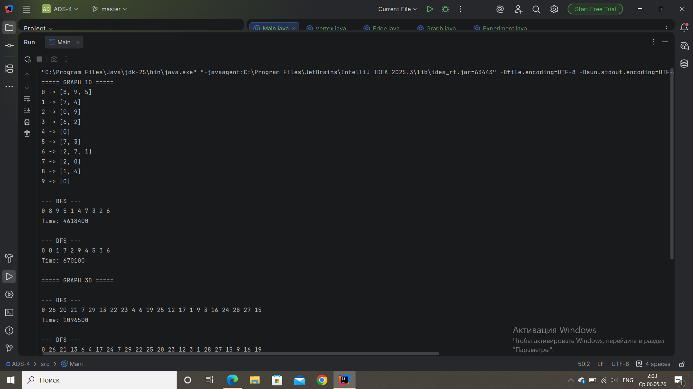
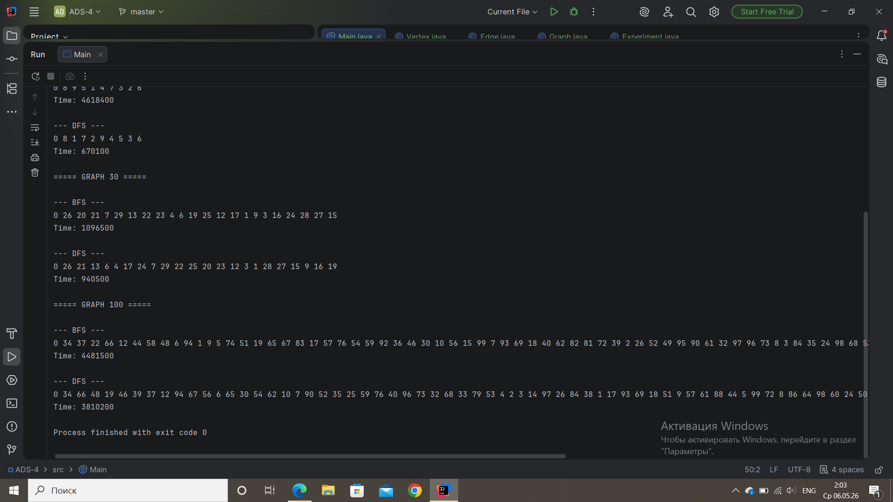
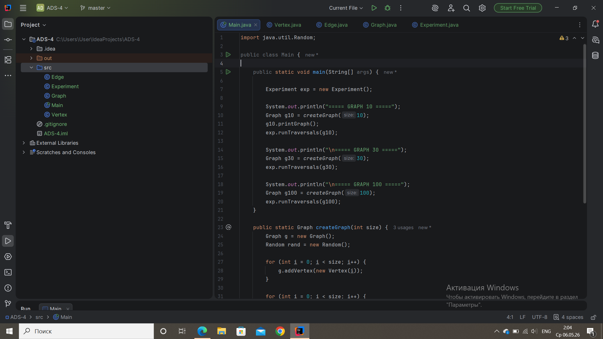
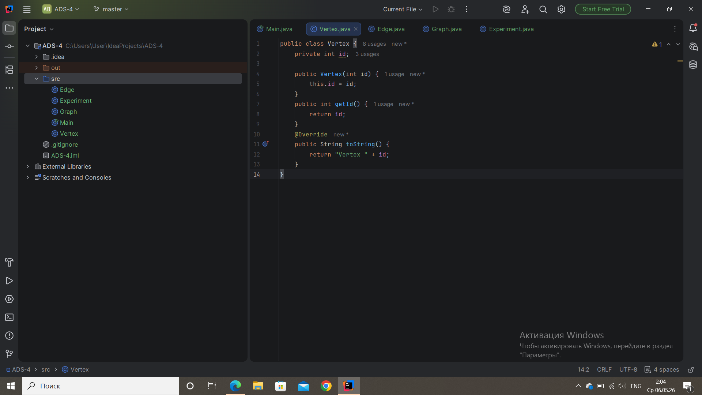
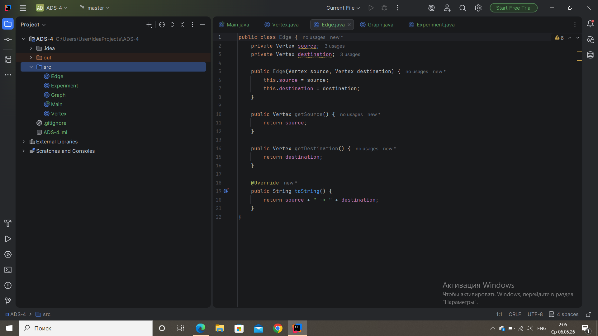
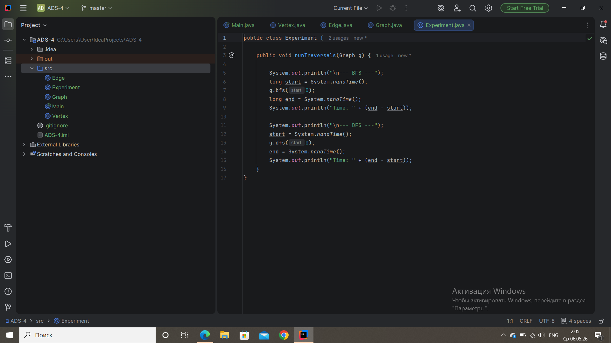
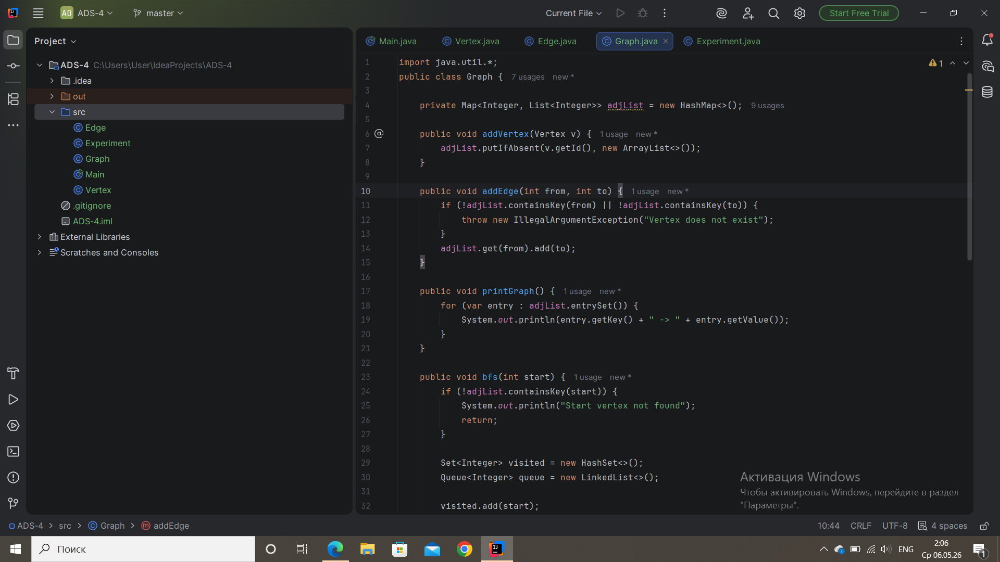
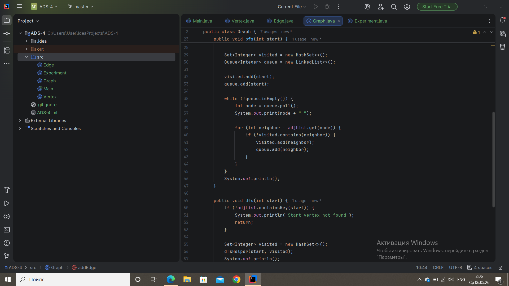
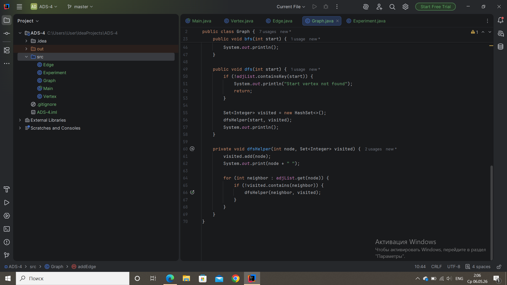

# Assignment 4 — Graph Traversal
## Overview

In this project I implemented a graph using an adjacency list and two traversal algorithms: BFS and DFS.
The program creates graphs with 10, 30 and 100 vertices, runs both algorithms and compares their execution time.

---

## Graph Representation

The graph is stored using a Map where each vertex has a list of its neighbors.

Example:

```java
Map<Integer, List<Integer>> adjList;
```

This is called an adjacency list and it is efficient for storing graphs.

---

## Classes

* Vertex — stores the id of a vertex
* Edge — represents connection between two vertices
* Graph — contains the graph structure and traversal algorithms
* Experiment — runs BFS and DFS and measures time
* Main — creates graphs and starts the program

---

## Algorithms

### BFS (Breadth-First Search)

BFS uses a queue and visits nodes level by level.
It is usually used when we need the shortest path.

Time complexity: O(V + E)

---

### DFS (Depth-First Search)

DFS uses recursion and goes as deep as possible before going back.
It is useful for exploring graphs.

Time complexity: O(V + E)

---

## Results

For 10 vertices:

* BFS time: 4618400 ns
* DFS time: 670100 ns

For 30 vertices:

* BFS time: 1096500 ns
* DFS time: 940500 ns

For 100 vertices:

* BFS time: 4481500 ns
* DFS time: 3810200 ns

---

## Analysis

From my results, DFS was slightly faster than BFS in most cases.
BFS uses more memory because of the queue, so it can be slower in practice.
As the graph size increases, the execution time also increases.
Both algorithms follow O(V + E) complexity.

---

## When to Use

BFS is better when we need to find the shortest path or work level by level.
DFS is better when we need to go deep into the graph or use recursion.

---

## Screenshot













---

## Conclusion

In this assignment I learned how graphs work and how BFS and DFS behave differently.
The main difficulty was implementing the traversal logic and organizing the code into classes.

---

## Author

Zhibek Akberdieva
